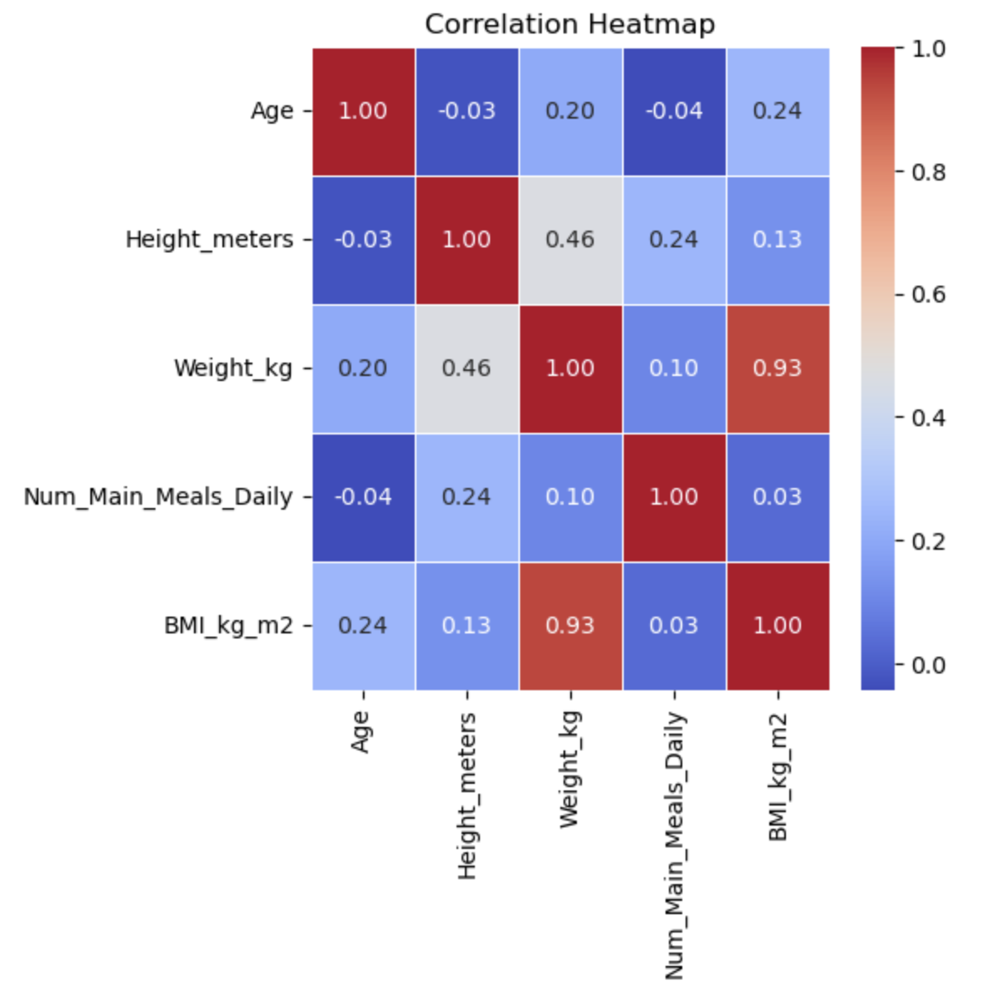
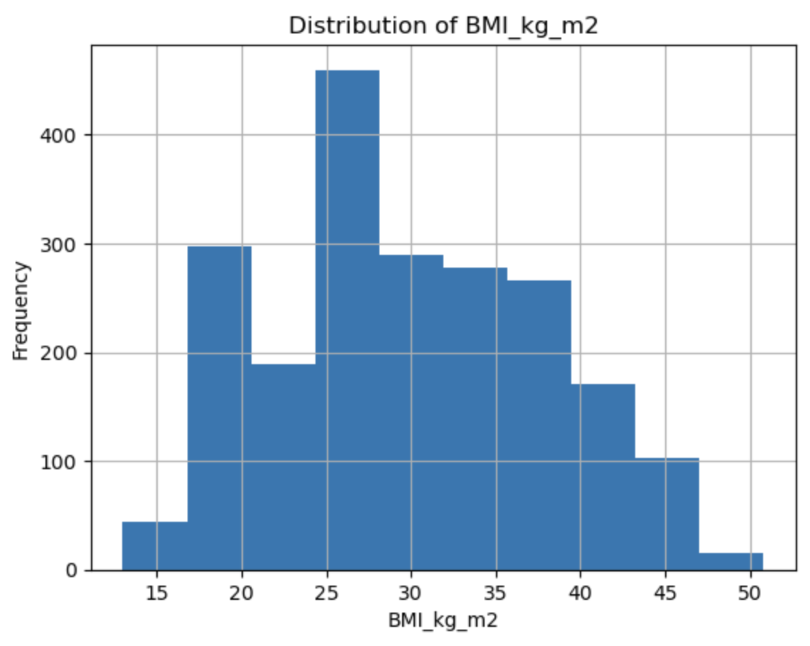
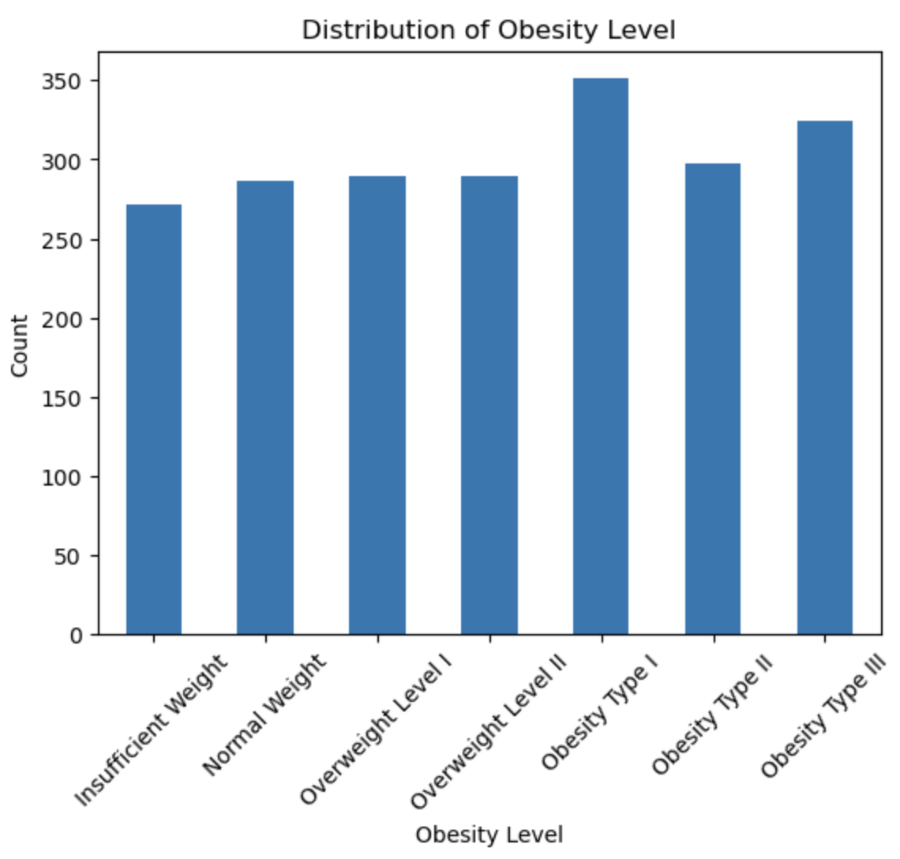

# Nutrition, Lifestyle, and Obesity Analysis

Machine learning analysis of nutrition, lifestyle, and physical health factors using regression, classification, clustering, and dimensionality reduction techniques to explore predictors of BMI and obesity level.

---

## Overview

This project explores relationships between nutrition, lifestyle habits, physical activity, and obesity outcomes using multiple machine learning and statistical modeling techniques. The analysis focuses on identifying predictors of BMI and obesity level while comparing the strengths and limitations of different modeling approaches.

---

## Dataset

We used the “Dataset for estimation of obesity levels based on eating habits and physical condition in individuals from Colombia, Peru, and Mexico” by Fabio Mendoza Palechor and Alexis de la Hoz Manotas.

The dataset was collected through anonymous survey responses and included demographic, nutrition, lifestyle, and physical activity variables.

Predictors included:
- family history
- age
- gender
- meal frequency
- water intake
- alcohol consumption
- exercise frequency
- transportation habits

Response variables included:
- BMI
- obesity level classification

---

## Exploratory Data Analysis

### Correlation Heatmap

### BMI Distribution

### Obesity Level Distribution

Key observations:
- Weight and BMI were highly correlated, which was expected since BMI is calculated using weight and height
- Obesity level categories were relatively balanced across the dataset
- BMI distribution showed a slight right skew, with most observations falling between 25–35 kg/m²

---

## Methods

This project applied multiple machine learning and statistical modeling techniques, including:

- Linear Regression
- Random Forest Regression
- Multiclass Logistic Regression
- K-Nearest Neighbors (KNN)
- K-Prototypes Clustering
- Principal Component Analysis (PCA)

The project compared predictive performance, interpretability, and clustering behavior across different approaches.

---

## Results

Key findings included:
- Random Forest outperformed linear regression for BMI prediction by capturing non-linear relationships and interactions
- Multiclass logistic regression successfully classified obesity levels with moderate predictive performance
- KNN performed well on extreme obesity categories but struggled with normal-weight classification
- PCA and clustering methods identified meaningful groupings associated with BMI and obesity level

The analysis also highlighted the importance of interpretability and responsible framing when working with health-related data.

---

## Technologies

- Python
- pandas
- NumPy
- scikit-learn
- matplotlib
- seaborn

---

## Project Materials

- [Project Notebook](Notebooks/obesity_ml_analysis.ipynb)
- [Final Presentation](Presentations/obesity_ml_analysis_presentation.pdf)

---

## Team Project

Completed as part of the UVA M.S. in Data Science program in collaboration with teammates Bela Barton, Ben Doniger, Emily Garman, and Natalie Seah.

My contributions focused on exploratory data analysis (EDA), introductory analysis, and multiclass logistic regression modeling.

---

## Important Note

BMI and obesity categories are limited, oversimplified, and imperfect measures of health. While these metrics were used for population-level modeling and analysis within this project, they should not be used to judge an individual's health, appearance, or value.
